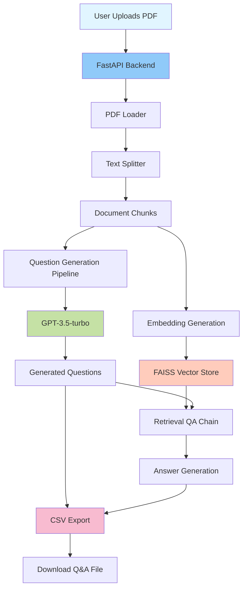

# 📝 Question Creator Application with LangChain

> An intelligent AI-powered application that automatically generates questions and answers from PDF documents using LangChain and OpenAI GPT models.

[](https://www.python.org/)
[](https://fastapi.tiangolo.com/)
[](https://www.langchain.com/)
[](https://openai.com/)
[](LICENSE)

---

## 📋 Table of Contents

- [Overview](#-overview)
- [Features](#-features)
- [Architecture](#-architecture)
- [Technology Stack](#-technology-stack)
- [Installation](#-installation)
- [Configuration](#-configuration)
- [Usage](#-usage)
- [API Endpoints](#-api-endpoints)
- [Project Structure](#-project-structure)
- [How It Works](#-how-it-works)
- [Contributing](#-contributing)
- [License](#-license)
- [Author](#-author)

---

## 🎯 Overview

The Question Creator Application is a sophisticated AI-powered tool designed to automatically generate comprehensive questions and answers from PDF documents. It leverages LangChain's document processing capabilities and OpenAI's GPT models to create educational content, making it ideal for:

- **Educational Institutions**: Generate practice questions from course materials
- **Training Programs**: Create assessment questions from training documents
- **Content Creators**: Automatically generate Q&A pairs from documentation
- **Exam Preparation**: Prepare study materials from textbooks and resources

---

## ✨ Features

- 📄 **PDF Document Processing**: Upload and process PDF files seamlessly
- 🤖 **AI-Powered Question Generation**: Automatically generates relevant questions using GPT-3.5-turbo
- 💡 **Intelligent Answer Extraction**: Retrieves accurate answers using RAG (Retrieval-Augmented Generation)
- 🔍 **Vector-Based Search**: Uses FAISS for efficient semantic search
- 📊 **CSV Export**: Exports generated Q&A pairs in CSV format
- 🌐 **Web Interface**: User-friendly web UI built with FastAPI and Jinja2
- ⚡ **Asynchronous Processing**: Fast and efficient document processing

---

## 🏗️ Architecture



### Architecture Components

1. **Document Processing Layer**: Handles PDF loading and text chunking
2. **Question Generation Layer**: Uses LangChain's refine chain to generate questions
3. **Vector Store Layer**: Creates embeddings and stores in FAISS for retrieval
4. **Answer Generation Layer**: Uses RAG to generate accurate answers
5. **Export Layer**: Formats and exports Q&A pairs to CSV

---

## 🛠️ Technology Stack

### Core Technologies
- **Python 3.10**: Programming language
- **FastAPI**: Modern, fast web framework for building APIs
- **LangChain**: Framework for developing applications with LLMs
- **OpenAI GPT-3.5-turbo**: Language model for question and answer generation

### Key Libraries
- **FAISS**: Vector similarity search library
- **PyPDF2**: PDF processing library
- **TikToken**: Token counting for text splitting
- **Uvicorn**: ASGI server
- **Jinja2**: Template engine
- **Python-dotenv**: Environment variable management

---

## 📦 Installation

### Prerequisites

- Python 3.10 or higher
- Conda (recommended) or pip
- OpenAI API key

### Step 1: Clone the Repository

```bash
git clone https://github.com/yourusername/Question-Creator-Application-with-Langchain.git
cd Question-Creator-Application-with-Langchain
```

### Step 2: Create Virtual Environment

Using Conda (Recommended):

```bash
conda create -n interview python=3.10 -y
conda activate interview
```

Using venv:

```bash
python -m venv venv
# On Windows
venv\Scripts\activate
# On Linux/Mac
source venv/bin/activate
```

### Step 3: Install Dependencies

```bash
pip install -r requirements.txt
```

### Step 4: Set Up Environment Variables

Create a `.env` file in the root directory:

```env
OPENAI_API_KEY=your_openai_api_key_here
```

---

## ⚙️ Configuration

The application uses the following default configurations:

- **Model**: GPT-3.5-turbo
- **Question Generation Temperature**: 0.3
- **Answer Generation Temperature**: 0.1
- **Question Chunk Size**: 10,000 tokens
- **Answer Chunk Size**: 1,000 tokens
- **Chunk Overlap**: 200 tokens (questions), 100 tokens (answers)

You can modify these settings in `src/helper.py`.

---

## 🚀 Usage

### Running the Application

1. **Activate the environment**:
   ```bash
   conda activate interview
   ```

2. **Start the FastAPI server**:
   ```bash
   python app.py
   ```

   Or using uvicorn directly:
   ```bash
   uvicorn app:app --host 0.0.0.0 --port 8080 --reload
   ```

3. **Access the web interface**:
   Open your browser and navigate to:
   ```
   http://localhost:8080
   ```

### Using the Application

1. **Upload PDF**: Use the web interface to upload a PDF document
2. **Process Document**: Click the analyze button to process the PDF
3. **Download Results**: Download the generated Q&A CSV file from the output folder

---

## 🔌 API Endpoints

### `GET /`
- **Description**: Serves the main web interface
- **Response**: HTML page with upload form

### `POST /upload`
- **Description**: Uploads a PDF file to the server
- **Parameters**:
  - `pdf_file`: PDF file (bytes)
  - `filename`: Name of the file (form data)
- **Response**: JSON with success message and file path

### `POST /analyze`
- **Description**: Processes the uploaded PDF and generates Q&A pairs
- **Parameters**:
  - `pdf_filename`: Path to the uploaded PDF file
- **Response**: JSON with output CSV file path

---

## 📁 Project Structure

```
Question-Creator-Application-with-Langchain/
│
├── app.py                 # FastAPI application entry point
├── requirements.txt       # Python dependencies
├── .env                   # Environment variables (create this)
├── README.md              # Project documentation
│
├── src/                   # Source code directory
│   ├── __init__.py
│   ├── helper.py          # Core LLM pipeline and document processing
│   └── prompt.py          # Prompt templates for question generation
│
├── templates/             # HTML templates
│   └── index.html         # Main web interface
│
├── static/                # Static files
│   ├── docs/              # Uploaded PDF files
│   └── output/            # Generated CSV files
│       └── QA.csv         # Output Q&A pairs
│
├── data/                  # Sample data files
│   ├── SDG.pdf
│   └── stats.pdf
│
└── reserach/              # Research and experiments
    └── experiment.ipynb   # Jupyter notebook for experimentation
```

---

## 🔄 How It Works

1. **Document Upload**: User uploads a PDF file through the web interface
2. **Text Extraction**: PDF is loaded and text is extracted using PyPDFLoader
3. **Text Chunking**: Text is split into chunks optimized for question and answer generation
4. **Question Generation**:
   - Uses LangChain's refine chain with GPT-3.5-turbo
   - Processes document chunks to generate comprehensive questions
5. **Vector Store Creation**:
   - Generates embeddings using OpenAI embeddings
   - Stores in FAISS vector database for efficient retrieval
6. **Answer Generation**:
   - For each generated question, retrieves relevant context
   - Uses RetrievalQA chain to generate accurate answers
7. **Export**: Saves all Q&A pairs to a CSV file for download

---

## 🤝 Contributing

Contributions are welcome! Please follow these steps:

1. Fork the repository
2. Create a feature branch (`git checkout -b feature/AmazingFeature`)
3. Commit your changes (`git commit -m 'Add some AmazingFeature'`)
4. Push to the branch (`git push origin feature/AmazingFeature`)
5. Open a Pull Request

### Development Guidelines

- Follow PEP 8 style guidelines
- Add docstrings to functions and classes
- Write clear commit messages
- Test your changes before submitting

---

## 📄 License

This project is licensed under the MIT License - see the [LICENSE](LICENSE) file for details.

---

## 👤 Author

**MD Uzzal Mia**

- Email: uzzal.ice.pust@gmail.com
- GitHub: [@yourusername](https://github.com/uzzal2200/Question-Creator-Application-with-Langchain)

---

## 🙏 Acknowledgments

- [LangChain](https://www.langchain.com/) for the amazing LLM framework
- [OpenAI](https://openai.com/) for GPT models
- [FastAPI](https://fastapi.tiangolo.com/) for the web framework
- [FAISS](https://github.com/facebookresearch/faiss) for vector similarity search

---

## 📊 Future Enhancements

- [ ] Support for multiple file formats (DOCX, TXT, etc.)
- [ ] Custom question types (multiple choice, true/false, etc.)
- [ ] Batch processing for multiple documents
- [ ] User authentication and document management
- [ ] Export to multiple formats (JSON, Excel, etc.)
- [ ] Question difficulty level classification
- [ ] Integration with learning management systems

---

**⭐ If you find this project helpful, please consider giving it a star!**

